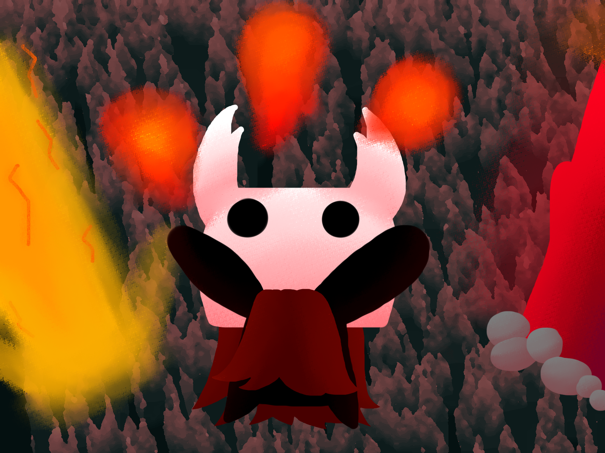
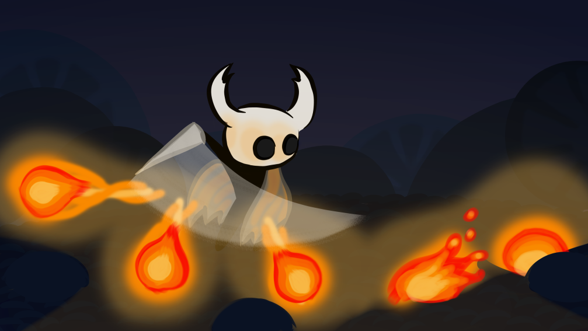
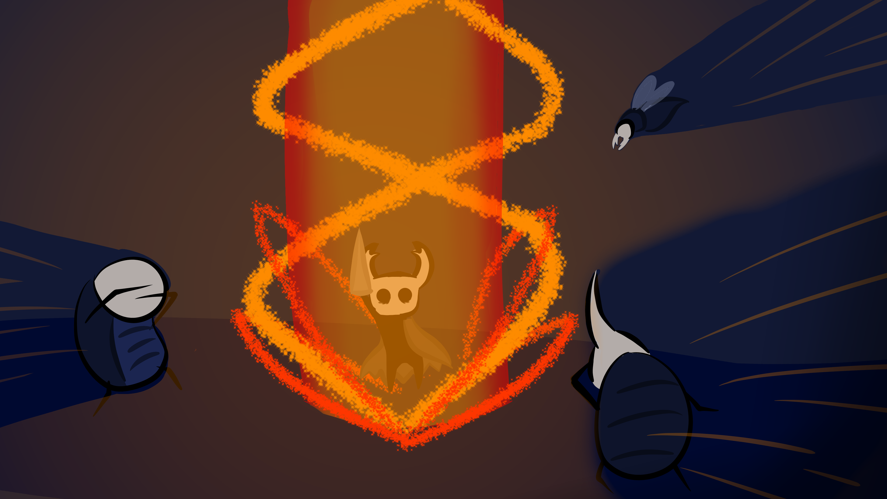

# redwing

This is a fork of AvengingAngle's redwing. The intent is to fix some bugs introduced with the GodMaster DLC and possibly pick up with the WIP Rebalance that AA started.

### Features

* Become a God, with 8 new fiery effects which augment your attacks and dashes, and help you when you get hit.
* A "hard" mode which forces you to use these flames as your primary weapon.
* 14 unique assets, all generated procedurally by the most advanced engine in any Hollow Knight mod. Enjoy unique fire every time you load the game.
* All damage and power values fully configurable. With Redwing, you get the final say on balance.
* Can function as an addon for Blackmoth, explicitly built to maximize compatibility and balance between the two.

### Effects

(drawn by Purple PyrOZ)

Redwing features numerous effects including:

Fireballs 

Pillars 
(drawn by FoldingPapers)

...and so much more, why not [watch this semi-outdated trailer video](https://www.youtube.com/watch?v=IoE9GuWDzPw) to see more of them.

### How to install

This mod depends on:

[ModCommon](https://github.com/Kerr1291/ModCommon) by Kerr1291

[Modding API](https://github.com/seanpr96/HollowKnight.Modding) by Wyza, Firzen, and Seanpr

It is also highly recommended you install this with:

[Blackmoth](https://github.com/Ayugradow/Blackmoth) by Gradow

You should probably install these from the [google drive, linked here](https://drive.google.com/drive/folders/0B_b9PFqx_PR9Um9MeFZMV21oWGs), or, if you know what you're doing, you can compile them from source code.

---

Credits:

Main Developer: Avenging Angle

In Collaboration with: [Gradow](https://gitlab.com/gradow), [KDT](https://github.com/kaydeetee), and [Seanpr](https://github.com/seanpr96)

Art: FoldingPapers, Purple PyrOz

Bug Testing: Finch

Special thanks:
[56](https://github.com/5fiftysix6)

The Grimm Crime Sindicate

The Ascended Mothposters

and most of all, YOU, for reading the README.

[Join us on our mini mod Discord to get the latest beta versions, or to hang out.](https://discord.gg/cED7ZGr)
